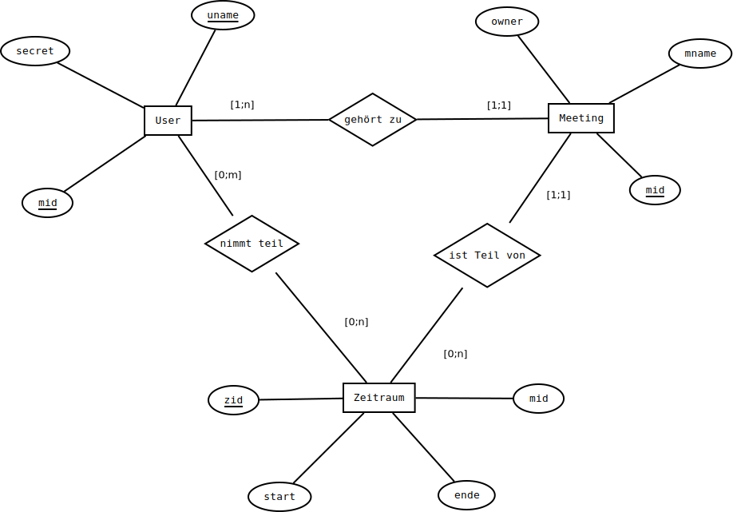

# /myflask/doodlebase.py

# Dokumentation Doodlebase
## Zweck
Dieses Paket soll eine reibungslose Schnittstelle zwischen Flask und Datenbank garantieren, indem repetetive Methoden ausgesourced und der Flaskquellcode somit von SQL-Befehlen befreit wurde.

## Datenbankstruktur
### ER-Diagramm


### Relationenschemata
  * $\rm meeting(\underline{mid}, mname, owner)$
  * $\rm user(\underline{uname}, \uparrow\underline{mid})$
  * $\rm zeitraum(\underline{zid}, \uparrow mid, start, ende)$
  * $\rm teilnahme(\uparrow\underline{zid}, \uparrow\underline{uname})$

## Methoden
### `createDoodle(mname, owner)`
Die Methode erstellt ein neues Meeting in der Datenbank.

```python
    while(True):
        id=newId()
        cur.execute(f"select mid from meeting where mid='{id}'")
        if len(cur.fetchall()) == 0:
            break
```
Dieser Teil garantiert, dass eine Meeting-ID erstellt wird, die noch nicht vorhanden ist.


### `addTime(mid, startzeit, endzeit)`
Fügt einen neuen Zeitraum für das der Meeting-ID entsprechende Meeting in der Datenbank ein.

### `addUser(uname, mid, usersecret)`
Diese Methode erstellt einen neuen Benutzer mit zugehöriger Meeting-ID und dem SHA512-gehashtem Passwort.

### `getMeeting(mid)`
Diese Methode liefert alle Daten des angeforderten Meetings zurück.

### `getZeiträumeVonMeeting(mid)`
Diese Methode ermittelt alle Zeiträume, welche für das angeforderte Meeting erstellt wurden.

### `getUsersOfZeitraum(zid)`
Ermittelt anhand der ID des Zeitraums, welche Nutzer an diesem Teilnehmen.

### `getSecret(mid, uname)`
Liefert das gehashte Passwort, welches der Nutzer bei der Erstellung des Accounts definiert hat.

### `getUserAmount(zid)`
Liefert die Anzahl der Teilnehmer zurück, welche im spezifizierten Zeitraum können.

### `getZeiträumeVonMeeting(mid)`
Liefert ein Tupel an Zeiträumen, welche zu genannter Meeting-ID gehören.

### `getZeiträumeOfUser(uname, mid)`
Ermittelt und returned die Zeitraum-IDs, welche der User eines Meetings ausgewählt hat. Hier müssen die Tabellen `zeitraum` und `user` auf `teilnahme` gejoint werden,

```sql
select 
z.zid 
from
((teilnahme t 
        join zeitraum z on z.zid=t.zid) 
        join user u on u.uname=t.uname) 
```

damit der User, welcher durch den geteilten Primärschlüssel `uname` und `mid` eindeutig definiert wird, klar bestimmt werden kann. Nutzernamen können nämlich doppelt vorkommen und aufgrund von Redundanz darf `teilnahme` nicht auch noch die Meeting-ID beinhalten. Der Join holt diese aus `zeitraum`.


### `getTitle(mid)`
Gibt den Title des Meetings zurück.

### `agreeToZeitraum(uname, mid, zids)`
Wenn ein Nutzer sein Formular, an welchen Zeiträumen er kann, abschickt, wird diese Methode vom Flask aufgerufen. Sie sammelt zunächst alle Zeiträume, an denen er bereits teilnimmt, und löscht diese aus `teilnahme`. Hierzu muss `getZeiträumeOfUser` genutzt werden, da die `unames` in `teilnahme` nur durch die `zids`, welche alle zu genau einer `mid` gehören, als User identifiziert werden können. Zwei Ralfs in `teilnahme` könnten zwei unterschiedliche Menschen oder die gleiche Person sein. Unterschieden werden kann hier nur anhand der `mids`, welche in den `zids` der Ralfs stecken.
Zu guter letzt werden die ausgewählten Zeiträume in `teilnahme` eingefügt.


### `isOwner(uname, mid)`
Liefert `True`, wenn der gesuchte Nutzer der Owner des Meetings ist, ansonsten `False`.

### `userExists(mid, uname)`
Prüft und gibt als boolean zurück, ob der Nutzer des Meetings existiert.

### `meetingExists(mid)`
Prüft und gibt als boolean zurück, ob das gesuchte Meeting existiert.

### `deleteZeitraum(zid)`
Diese Methode löscht den Zeitraum, welcher durch `zid` identifiziert wird. Durch Foreignkeys mit `ON DELETE CASCADE` werden Löschanomalien vermieden.

### `deleteMeeting(mid)`
Diese Methode übernimmt das Löschen eines Meetings. Indem die Foreignkeys aller Tabellen auf `ON DELETE CASCADE` gestellt wurden, werden Löschanomalien vermieden und das Löschen des Meetings beseitigt alle zugehörigen Daten.